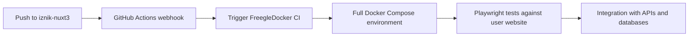

# CircleCI Continuous Integration

This repository uses a **centralized testing approach** where Playwright tests run exclusively in the [FreegleDocker repository](https://github.com/Freegle/FreegleDocker), not locally.

## Why No Local CI?

**Playwright tests DO NOT run in this repository to prevent contamination of live systems.**

### Testing Philosophy
- **Production Safety**: Avoids any risk of test code affecting live Freegle systems
- **Realistic Testing Environment**: Tests run against complete Docker Compose stack
- **Integration Focus**: Tests the full system as users experience it
- **Resource Efficiency**: One comprehensive test environment vs. multiple isolated ones

### What This Means
❌ **No local CircleCI** - This repository has no `.circleci/config.yml`  
❌ **No Playwright runs here** - All E2E testing happens in FreegleDocker  
✅ **Development tools only** - ESLint, development server, build tools
✅ **Integration testing** - Full system testing via FreegleDocker

## Integration Testing

**All Playwright tests for this repository run in [FreegleDocker](https://github.com/Freegle/FreegleDocker).**

### Complete Test Coverage
The FreegleDocker environment tests:
- **User Website Functionality** (this repository's code)
- **Cross-Service Integration** (with APIs and databases)  
- **Production-Like Environment** (full Docker Compose stack)
- **Real User Workflows** (end-to-end Playwright scenarios)

### Automated Triggering

When you push changes to this repository:

1. **No Local Tests**: No testing occurs in this repository
2. **Triggers FreegleDocker**: GitHub Actions webhook triggers comprehensive testing
3. **Full System Validation**: Complete environment tests your frontend changes



## Webhook Configuration

This repository includes `.github/workflows/trigger-parent-ci.yml` that automatically triggers FreegleDocker testing.

### Setup Requirements
The webhook requires a `CIRCLECI_TOKEN` secret in this repository:

1. **Get Token**: CircleCI → Personal API Tokens
2. **Add Secret**: Repository Settings → Secrets and Variables → Actions
3. **Name**: `CIRCLECI_TOKEN`
4. **Value**: Your CircleCI API token

### Webhook Status
✅ **Active** - Pushes to `master` automatically trigger FreegleDocker integration testing

## Testing Scope

**What Gets Tested (in FreegleDocker):**
- **User Interface**: All pages, components, and user interactions
- **Authentication Flows**: Login, signup, password reset via Google OAuth
- **Message Posting**: Give/Want item posting and editing workflows  
- **Messaging System**: Chat functionality and real-time communication
- **Location Services**: Postcode lookup, mapping, and geolocation
- **Image Handling**: Upload, processing, and display of images
- **Responsive Design**: Mobile and desktop layouts
- **Performance**: Page load times and rendering performance
- **Cross-Browser**: Multiple browser engine testing

**What Doesn't Get Tested Locally:**
- No unit tests (component-level testing)
- No isolated frontend testing
- No development-only test runs

## Development Workflow

### Local Development
```bash
# Development server with hot reloading
npm run dev

# Production build testing  
npm run build
npm run start

# Code quality (the only "testing" done locally)
npm run lint
eslint --fix <files>
```

### Testing Your Changes
1. **Develop Locally**: Use `npm run dev` for rapid development
2. **Push Changes**: Commit and push to trigger integration testing
3. **Monitor FreegleDocker**: Check [CircleCI FreegleDocker](https://app.circleci.com/pipelines/github/Freegle/FreegleDocker)
4. **Review Results**: Access Playwright HTML reports via build artifacts

### Adding New Tests
**To add new Playwright tests:**
1. **Edit tests in FreegleDocker**: Navigate to `FreegleDocker/iznik-nuxt3/tests/e2e/`
2. **Follow existing patterns**: Use established utilities and fixtures
3. **Test locally in FreegleDocker**: Run tests in Docker environment
4. **Push FreegleDocker changes**: New tests will run automatically

## Monitoring & Results

### Integration Test Results
- View results at: [CircleCI FreegleDocker](https://app.circleci.com/pipelines/github/Freegle/FreegleDocker)
- Access Playwright HTML reports via build artifacts
- Monitor real-time test progress via status container

### No Local Results
- No CircleCI dashboard for this repository
- No local test artifacts or reports
- All testing feedback comes via FreegleDocker builds

## Test Environment Access

### Development Testing
```bash
# In FreegleDocker repository:
docker exec -it freegle-playwright bash
npm run test                    # Run all tests
npm run test:ui                # Run with UI  
npm run test:headed            # Run in headed mode
npm run test:show-report       # View HTML reports
```

### Test URLs (via FreegleDocker)
- **Development**: `http://freegle-dev.localhost` (hot reloading)
- **Production**: `http://freegle-prod.localhost` (production build - what Playwright tests)
- **Test Reports**: `http://localhost:9324` (after running tests)

## Related Documentation

- [Nuxt.js Development Guide](README.md)
- [Playwright Testing Documentation](tests/e2e/README.md)
- [FreegleDocker Integration Testing](https://github.com/Freegle/FreegleDocker/blob/master/CircleCI.md)
- [Complete Testing Guide](https://github.com/Freegle/FreegleDocker/blob/master/README.md#testing)